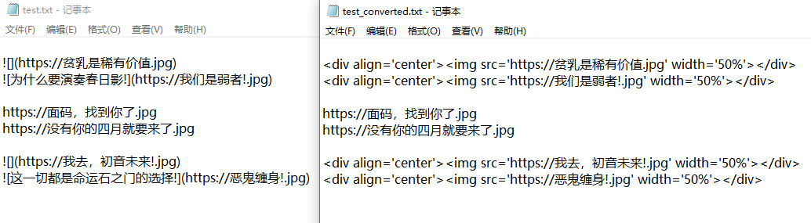

# Markdown图片插入格式转换为Html图片插入格式(Markdown Image Insertion Format to Html Image Insertion Format)

Md2Html.exe为可执行程序，Markdown_to_Html.cpp为源码

Md2Html.exe is the executable, and Markdown_to_Html.cpp is the source code

## 简介：此程序将MD默认的图片插入格式转换成HTML图片插入格式，并自动添加居中和尺寸大小变化(Introduction: This program will be the MD default image insertion format into HTML image insertion format, and automatically add the centre and size of the size change)


源文件名为XXX.txt或者XXX

The source file is named XXX.txt or XXX.


将源拖动到该exe程序后，在原文件所在目录生成XXX_converted.txt文件或者XXX_converted

After dragging the source to the exe program, it will generate XXX_converted.txt or XXX_converted in the directory where the original file is located.


将源文件中的

Change the source file's

```

```


格式的MD图片插入语句转换成

MD Picture Insert statement in format is converted to a

```
<div align='center'></div>
```


## 示例：(Example:)


